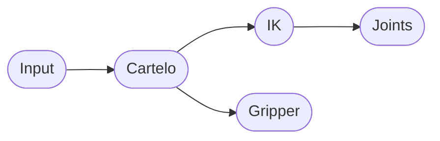

# Cartelo

Teleoperate ROS 2 robot arms using cartesian coordinate inputs from 3D trackers (VR controllers, smartphones, etc.).

> [!WARNING]
> This project is still under construction 🚧
>
> My goal is to create an imitation learning fine tuning dataset using an UR12e arm and a HTC Vive controller. If you are interested in combining LeRobot with ROS 2 check out [LeROS2](https://github.com/Nico0302/leros2).

## Usage

Cartelo can take any [tf2](https://docs.ros.org/en/jazzy/Tutorials/Intermediate/Tf2/Tf2-Main.html) frame and an optional `Joy` topic and output a desired target pose to an inverse kinematic node (like MoveIt2 Servo, Cartesian Controllers, CRISP Controllers, etc.).

To start teleportation, the operator can move the 3D tracking device close to the robot base and press the preconfigured calibration button (i.e. menu button). 
Now all movements will be transferred to the robot as long as the teleportation button (i.e. side grippers) is pressed down.

Additionally, the operator can use the preconfigured buttons or axes to control the gripper.
